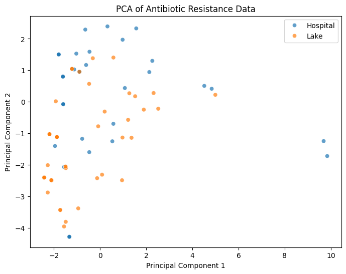
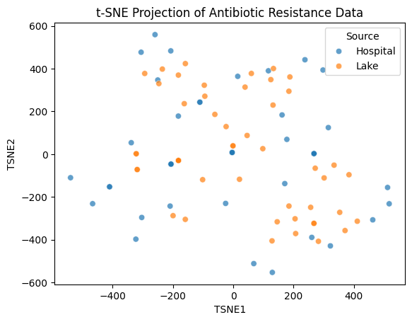
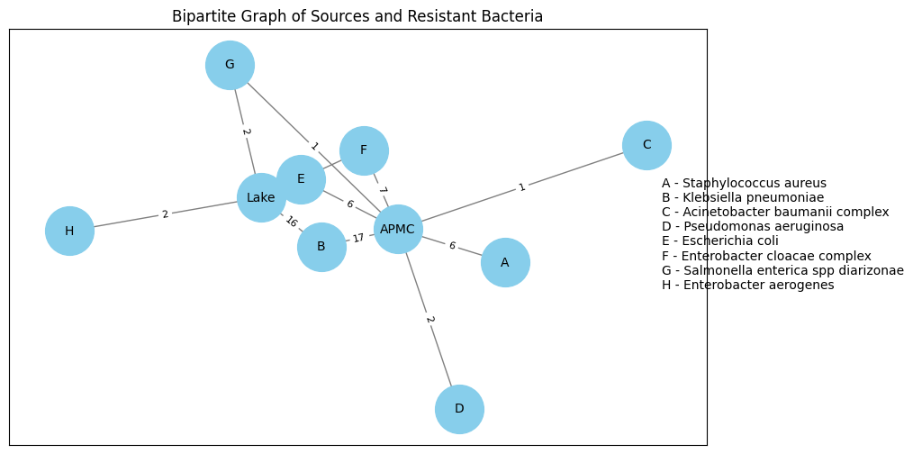

# AMR Project: Antibiotic Resistance Data Analysis

This repository contains the analysis of antibiotic resistance data using various computational techniques, including **Principal Component Analysis (PCA)**, **t-Distributed Stochastic Neighbor Embedding (t-SNE)**, **network analysis**, and **statistical hypothesis testing**.

---

## 1. Data Visualization and Dimensionality Reduction

### PCA of Antibiotic Resistance Data
Principal Component Analysis (PCA) was performed to reduce the dimensionality of the dataset while preserving variance. The scatter plot below shows how the samples (hospitals and lakes) are distributed along the principal components.


- The PCA scatter plot shows the separation of antibiotic resistance profiles between samples from **hospitals (blue)** and **lakes (orange)**.
- There is **some overlap**, indicating shared resistance patterns, but distinct clustering suggests notable differences in resistance characteristics.

### t-SNE Projection
t-SNE was used for non-linear dimensionality reduction to better visualize clusters in the data.


- The t-SNE scatter plot shows a more spread-out clustering pattern.
- This suggests that **nonlinear relationships** may exist between antibiotic resistance features, which PCA (a linear method) cannot fully capture.
- The **hospital and lake samples still form distinguishable clusters**, supporting the idea of source-dependent variations in resistance.

---

## 2. Network Analysis: Bacterial Transmission
A bipartite network graph was created to illustrate the connections between different sources (hospitals, lakes) and the resistant bacterial species.



### Interpretation:
This bipartite network graph represents the relationship between **sources** (e.g., "Lake" and "APMC") and **resistant bacterial species**. The nodes are divided into two distinct sets:
- **Sources (Lake, APMC)**
- **Bacterial species (A, B, C, D, E, F, G, H)**

Edges between nodes indicate the presence of antibiotic-resistant bacteria in a specific source, with **edge weights representing connection strength** (e.g., frequency of occurrence).

## Key Observations
1. **Central Nodes:**
   - The **APMC source** has multiple connections to different bacteria, indicating a **high diversity of resistant strains**.
   - **Lake is also a major hub**, showing resistance from several bacterial species.

2. **Highly Connected Bacteria:**
   - **Escherichia coli (E)** is **strongly linked to both Lake and APMC**, suggesting that this species is prevalent in both sources.
   - **Klebsiella pneumoniae (B)** and **Enterobacter cloacae complex (F)** also have multiple connections.

3. **Source-Specific Bacteria:**
   - **Acinetobacter baumannii complex (C)** appears to be more associated with **APMC**, potentially indicating a **hospital-acquired resistance pattern**.
   - **Salmonella enterica spp diarizonae (G)** and **Enterobacter aerogenes (H)** are primarily linked to **Lake**, which may be due to **environmental contamination**.

4. **Edge Weights and Strength of Association:**
   - The numbers on the edges indicate the **frequency of resistance detection**.
   - **APMC has a strong connection (weight = 17) with Escherichia coli**, suggesting **frequent resistance in clinical settings**.
   - **Lake has a notable connection (weight = 16) with Escherichia coli**, highlighting the **spread of resistance beyond hospitals into natural environments**.

## Interpretation
- **Hospital and environmental sources share common resistant bacteria**, suggesting **potential horizontal gene transfer**.
- **Certain bacteria are more source-specific**, possibly due to differences in **antibiotic exposure and selective pressures**.
- **Stronger connections (higher edge weights) indicate bacterial species that are of high concern** in terms of resistance prevalence.

## Next Steps
- **Community detection analysis** to identify resistance clusters.
- **Temporal studies** to track resistance evolution over time.
- **Metagenomic analysis** to confirm genetic similarities between hospital and environmental bacteria.

---
This bipartite network analysis highlights the interconnectedness of antibiotic-resistant bacteria across different sources, emphasizing the need for **integrated monitoring and control strategies**.


---

## 3. Statistical Analysis: t-Test Results
A **t-test** was conducted to determine significant differences in antibiotic resistance levels between sources. The following antibiotics showed statistically significant differences in resistance levels:

| Antibiotic | t-statistic | p-value  |
|------------|------------|----------|
| AMP        | 2.579181   | 0.011566 |
| CFX        | 4.313463   | 0.000042 |
| CFL        | 3.218768   | 0.001834 |
| CFP        | 2.703055   | 0.009590 |
| CFA        | 2.816276   | 0.007583 |
| CFO        | 2.014534   | 0.047949 |
| CFI        | 2.715967   | 0.008626 |
| NIT        | 2.285750   | 0.025315 |

Antibiotics with **p-value < 0.05** indicate statistically significant differences, suggesting notable variations in resistance between the sources.

---

## How to Use
1. Clone this repository:
   ```bash
   git clone https://github.com/jingtorls134/amr_project.git
